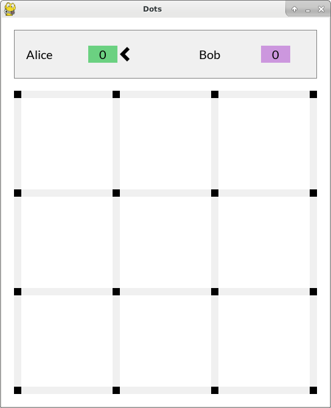
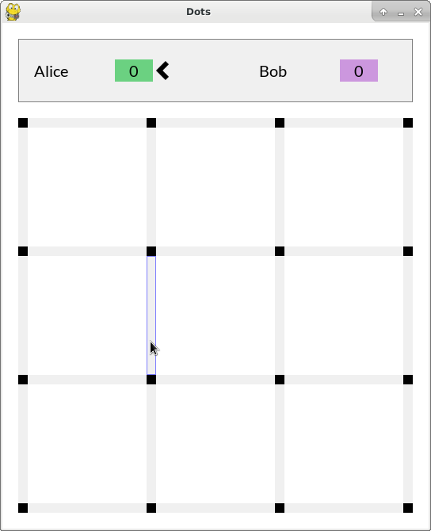
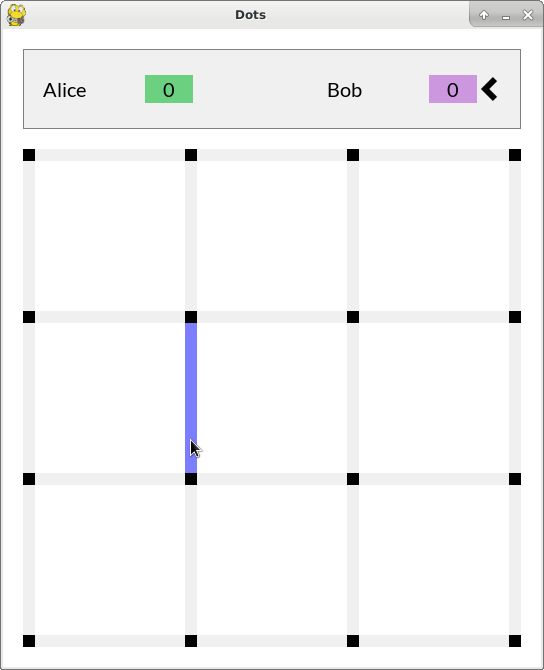
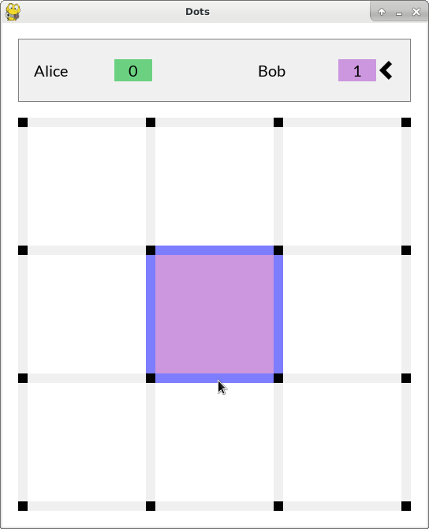
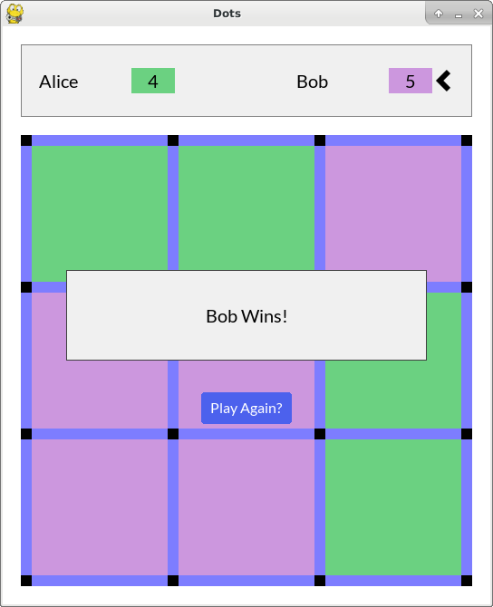

Introduction
============

Dots is an implementation of the classic game where you draw a bunch of dots on
a piece of paper in a grid pattern and then players take turns connecting the
dots. When a square, or cell, is made the player "captures" the cell. The player
with the greatest number of captured cells at the end of the game wins.

Dots has always been a favorite game of mine and when I decided I wanted to
learn a little bit about game programming, I figured Dots would be a good place
to start. Dots is simple enough that I figured I wouldn't get bogged down in the
details of the game during implementation, but complex enough that making the
game would give me a nice little taste of game programming. Since Python is my
go-to language I figured Pygame would be a good place to start.

Requirements
============
There are just two requirements for running Dots:

1. Python 3.7.7 or greater (https://www.python.org/downloads/)
2. Pygame 2.0.0 or greater (https://www.pygame.org/)

During development I use Python virtual environments to isolate the Python
version and packages I need. Feel free to use whatever you are comfortable with.

Running the Game
================
Dots is executed from the command line. Below is the usage documentation when
starting with the -h or --help option.

```
$ python dots.py -h
usage: dots.py [-h] [-r ROWS] [-c COLUMNS] [-w CELL_WIDTH] [-t CELL_HEIGHT] [-p [PLAYER ...]]

A pygame implementation of the classic game of trying to capture as many cells as you can by connecting the dots.

optional arguments:
    -h, --help       show this help message and exit
    -r ROWS          number of rows of cells (default: 4)
    -c COLUMNS       number of columns of cells (default: 4)
    -w CELL_WIDTH    width of cells (default: 100 pixels)
    -t CELL_HEIGHT   height of cells (default: 100 pixels)
    -p [PLAYER ...]  names of the two to four players (default: Alice Bob)
```

As you can see, there are default values for all options so simply executing
dots.py will run the game for you.

Playing the Game
================
When you first start the game, the game board will look something similar to
this:



The left pointing arrow indicates whose turn it is to connect two dots. To
connect two dots, simply move your mouse over an edge between two dots. As you
hover over an edge, the edge will be outlined to highlight the edge as shown
below:



Click on the edge to join the two dots. Once you click on the edge it will be
permanently colored in indicating the dots are now joined. Clicking on an edge
that already connects two dots has no effect. After connecting two dots, it
becomes the next player's turn. You will see the left pointing arrow now points
at the next player.



Players continue alternating connecting dots until a cell is captured by
connecting all of the dots that make up the cell. If connecting two dots
captures a cell, the cell's background color changes to the color of the player
that captured the cell. The player's score also updates when a cell is captured.
Additionally, the player that captured the cell gets to connect another two
dots. As long as the player continues capturing cells, it remains their turn.



Continue with game play until all of the cells have been captured and a winner
is determined. At the end of the game, you will have the option to start a new
game. Click the "Play Again?" button to start a new game.



I hope you enjoy playing the game!
